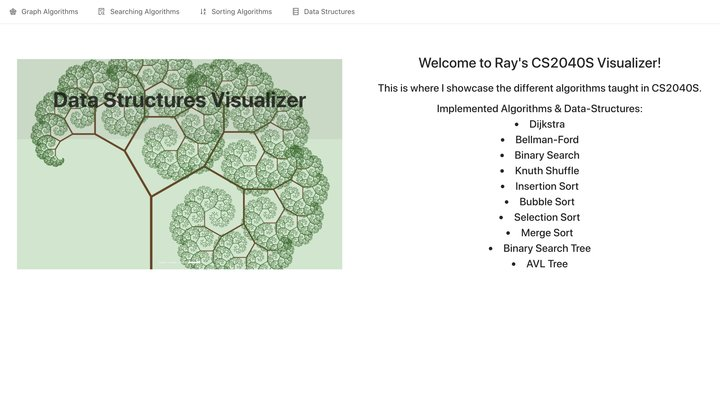
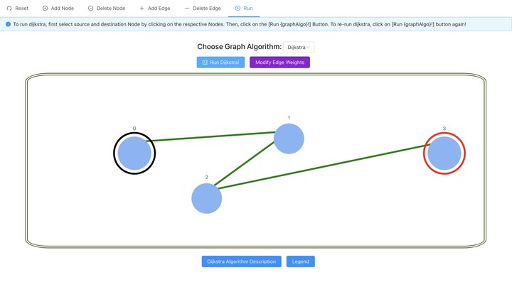
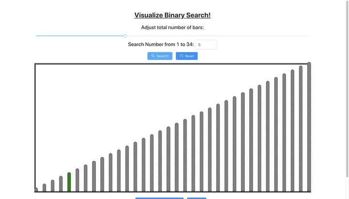
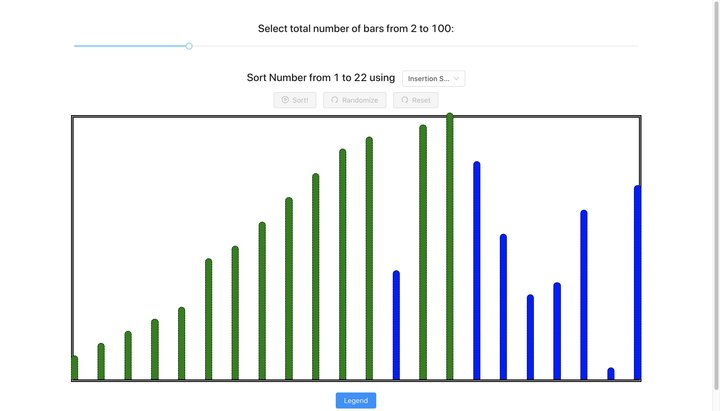
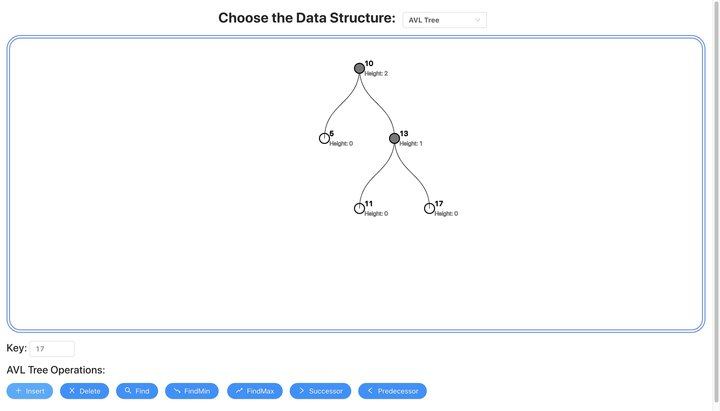

# CS2040S-ALGO-VISUALIZER

> A web-app that visualizes the different algorithms and data structures that were taught in CS2040S, the Data Structures and Algorithms undergraduate Computer Science course in the National University of Singapore (NUS).

## Table of contents

- [General info](#general-info)
- [Screenshots](#screenshots)
- [Technologies](#technologies)
- [Setup](#setup)
- [Features](#features)
- [Contact](#contact)

## General info

I created this web-app as a fun side-project to help me understand data structures and algorithms while I was taking CS2040S. This project has really paid off for me as I learnt the various naunces and tricky bugs of the data structures and algorithms that were taught by implementing them from scratch. I hope that future CS students can benefit from the usage of my web-app by first taking a seemingly complex data structure / algorithm, visualizing how it works in practice on different inputs, and then understanding the high-level idea behind it.

## Screenshots

## Technologies

- Javascript
- ReactJS 
- Redux
- Ant-Design

## Setup

1. Clone this repo
2. In project root, run: `npm ci`
3. To setup ReactJS, refer to https://reactjs.org/docs/getting-started.html
4. To setup Ant-Design, refer to https://ant.design/docs/react/introduce
5. To setup Redux, refer to https://react-redux.js.org/introduction/quick-start
6. After completing the pre-requisite setup, run `npm run start` to start the local dev server
7. You should be able to view the web-app at http://localhost:3000

## Features

- Create your own graph - indicate the position of your graph node by clicking on the canvas and create an edge between 2 nodes by clicking on those 2 nodes.
- Modify edge weights (default edge weight is 1).
- Visualize *Dijkstra* with color-coding that indicates the current Node that was extracted from the Priority Queue as well as the exact edge which is being relaxed.
- Visualize *Bellman-Ford* with color-coding that indicates current Node and the exact edge that is being relaxed.
- Visualize shortest path after running *Dijkstra* / *Bellman-Ford*.
- Visualize *Binary Search* on a monotonically increasing array at each step with color-coding.
- Visualize *Insertion*, *Bubble*, *Selection* and *Merge Sort* at each step on a randomized array.
- Randomize array using the *Knuth Shuffle* algorithm.
- Visualize standard operations on *Binary Search Tree* and *AVL Tree*.
- Brief description of each algorithm, its ideal use case, and some pseudocode to give an idea of its implementation.

Nice to have features:

- Implement directed graphs (so *Bellman-Ford* can work on negative weight edges).
- Prevent user from sorting after the array is already sorted
- Add functionality to change visualization speed
- Visualize *Quick-Select*
- Visualize *HashMaps*
- Visualize *SkipLists*

## Contact

Created by [@raysonkoh](https://www.raysonkoh.com/) - feel free to contact me!